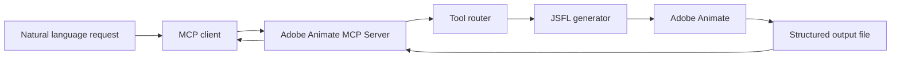

<p align="center">
  
</p>

<h1 align="center">Adobe Animate MCP Server</h1>

<p align="center">
  Control Adobe Animate from an MCP-compatible AI assistant using natural language, JSFL automation, and structured tool responses.
</p>

<p align="center">
  <a href="https://modelcontextprotocol.io/"></a>
  
  
  
</p>

---

## Overview

`adobe-animate-mcp-server` is a local Model Context Protocol server that lets an AI assistant control Adobe Animate through JSFL, Adobe Animate's scripting system.

Instead of manually writing and running JSFL scripts, you can ask your assistant to create documents, draw shapes, manage timelines, add ActionScript, inspect symbols and layers, read compiler output, and export/publish work. The server translates those requests into JSFL, runs them in Adobe Animate, and returns structured results back to the assistant.

This is especially useful for animation prototyping, Flash/Animate game workflows, repetitive authoring tasks, and debugging timeline or ActionScript projects.

## Highlights

- Create new Animate documents with custom dimensions and frame rates.
- Draw rectangles, ovals, text, and imported image assets.
- Add layers, keyframes, classic tweens, and symbols.
- Add ActionScript 3.0 to frames, instances, and named symbols.
- Inspect the current project name, file path, save state, layers, and library items.
- Run custom JSFL and return structured JSON back to the AI assistant.
- Check compiler/debug output and trigger test movie workflows.
- Export or publish Animate projects from natural language commands.

## Requirements

- Adobe Animate 2020 or later.
- Node.js 18 or later.
- An MCP-compatible client, such as Cursor, Claude Desktop, or another MCP host.
- Windows or macOS. The current executor includes Windows-oriented Animate paths, but the JSFL concepts are cross-platform.

## Quick Start

Install dependencies and build the server:

```bash
npm install
npm run build
```

Start the server locally:

```bash
npm start
```

For development, rebuild and start in one command:

```bash
npm run dev
```

## MCP Client Setup

Add the server to your MCP client configuration. Replace the example path with the absolute path to your local `dist/index.js`.

```json
{
  "mcpServers": {
    "adobe-animate": {
      "command": "node",
      "args": [
        "C:/path/to/adobe-animate-mcp-server/dist/index.js"
      ]
    }
  }
}
```

On Windows, forward slashes are recommended inside JSON paths:

```text
C:/Users/YourName/projects/adobe-animate-mcp-server/dist/index.js
```

After saving the config, restart your MCP client so it reloads the server.

## How It Works



1. You ask your assistant to do something in Adobe Animate.
2. The MCP client sends a tool call to this server.
3. The server chooses the matching tool and generates JSFL.
4. The JSFL runs in Adobe Animate.
5. Results are written to a temporary output file and returned to the assistant.

## Example Prompts

Create a document:

```text
Create a new Adobe Animate document that's 1280x720 at 30fps.
```

Draw artwork:

```text
Draw a dark blue rectangle that fills the background, then add white title text in the center.
```

Set up a game scene:

```text
Create layers named Background, Player, Enemies, UI, and Actions.
```

Inspect the current project:

```text
What is the current Animate project name and where is the FLA saved?
```

Debug ActionScript:

```text
Test my movie and show me any compiler errors or warnings.
```

Run custom JSFL and return data:

```text
Run custom JSFL that returns the current document name and layer count.
```

## Tool Reference

### Document And Drawing

| Tool | What It Does |
| --- | --- |
| `create_new_document` | Creates a new Animate document with dimensions and frame rate. |
| `save_document` | Saves the current `.fla` file to a specific path. |
| `add_layer` | Adds a new timeline layer. |
| `draw_rectangle` | Draws a rectangle on the stage. |
| `draw_oval` | Draws an oval or ellipse on the stage. |
| `add_text` | Adds editable text to the stage. |
| `import_image` | Imports an image to the stage or library. |
| `export_movie` | Publishes or exports the current animation. |

### Animation

| Tool | What It Does |
| --- | --- |
| `create_keyframe` | Inserts a keyframe at a specific frame. |
| `create_motion_tween` | Creates a classic motion tween between frames. |
| `convert_to_symbol` | Converts selected artwork into a movie clip, button, or graphic symbol. |

### ActionScript 3.0

| Tool | What It Does |
| --- | --- |
| `add_actionscript_to_frame` | Adds ActionScript to a specific timeline frame. |
| `add_actionscript_to_instance` | Adds ActionScript to the selected instance. |
| `set_document_class` | Sets the AS3 document class. |
| `add_stop_action` | Adds `stop();` to a frame. |
| `add_gotoAndPlay_action` | Adds `gotoAndPlay(...)` frame navigation. |
| `add_gotoAndStop_action` | Adds `gotoAndStop(...)` frame navigation. |

### Inspection And Debugging

| Tool | What It Does |
| --- | --- |
| `get_document_info` | Returns document dimensions, timeline state, layers, and project name fields. |
| `get_project_info` | Returns project name, file path, save state, document class, timeline summary, and library summary. |
| `get_compiler_errors` | Reads document/debug status or starts a test movie compile check. |
| `clear_output_panel` | Clears the Adobe Animate output panel. |
| `get_library_items` | Lists symbols, bitmaps, sounds, fonts, and other library items. |
| `get_layers_info` | Returns detailed layer information. |
| `select_layer_by_name` | Selects a layer by name. |
| `add_actionscript_to_symbol_by_name` | Finds a named symbol instance and adds ActionScript. |

### Utilities

| Tool | What It Does |
| --- | --- |
| `select_all` | Selects all elements on the current frame. |
| `delete_selection` | Deletes the current selection. |
| `run_custom_jsfl` | Runs custom JSFL for advanced workflows. |

## Project Metadata Capture

The `get_project_info` tool is designed for workflows where the assistant needs to understand the active Animate file before making changes.

Typical response fields include:

```json
{
  "projectName": "GLING DING HORROR GAME",
  "documentName": "GLING DING HORROR GAME.fla",
  "fileName": "GLING DING HORROR GAME.fla",
  "path": "C:\\Users\\You\\Documents\\GLING DING HORROR GAME.fla",
  "saved": true,
  "modified": false,
  "dimensions": {
    "width": 640,
    "height": 480,
    "frameRate": 30
  }
}
```

This helps the assistant avoid guessing which project is open and makes it easier to build game-specific workflows around the active `.fla`.

## Custom JSFL Output

`run_custom_jsfl` supports structured output. Inside your JSFL, assign a value to `__mcpResult` and the server will return it to the MCP client:

```javascript
var doc = fl.getDocumentDOM();

__mcpResult = {
  documentName: doc ? doc.name : null,
  layerCount: doc ? doc.getTimeline().layerCount : 0
};
```

If custom JSFL throws an error, the MCP response includes the error instead of only saying the script executed.

## Example Scripts

The `examples/` directory contains standalone JSFL scripts that can be run manually from Adobe Animate:

- `examples/create_bouncing_ball.jsfl`
- `examples/create_text_animation.jsfl`
- `examples/draw_shapes.jsfl`

To run one manually, open Adobe Animate and choose **Commands > Run Command...**, then select the `.jsfl` file.

## Project Structure

```text
adobe-animate-mcp-server/
├── src/
│   ├── index.ts
│   ├── tools.ts
│   └── jsfl-executor.ts
├── examples/
├── dist/
├── adobe-animate-logo.png
├── package.json
├── tsconfig.json
└── README.md
```

Key files:

- `src/index.ts` starts the MCP server and registers tool handlers.
- `src/tools.ts` defines tool schemas and generates JSFL scripts.
- `src/jsfl-executor.ts` writes JSFL to disk, launches Animate, captures structured output, and returns it to the MCP client.

## Development

Build the TypeScript project:

```bash
npm run build
```

Run the compiled server:

```bash
npm start
```

Run a development cycle:

```bash
npm run dev
```

## Troubleshooting

### Adobe Animate Must Be Running

Adobe Animate needs to be installed and available for JSFL execution. Some workflows work best when Animate is already open with a document loaded.

### Restart Your MCP Client After Changes

If you add a new tool or rebuild the server, restart your MCP client so it reloads the tool list.

### Use Forward Slashes In Config Paths

Use this in MCP JSON config:

```text
C:/Users/YourName/projects/adobe-animate-mcp-server/dist/index.js
```

Avoid unescaped backslashes in JSON:

```text
C:\Users\YourName\projects\adobe-animate-mcp-server\dist\index.js
```

### Manual JSFL Fallback

If automatic execution fails, you can still run generated JSFL manually:

1. Copy the JSFL script.
2. Open Adobe Animate.
3. Choose **Commands > Run Command...**.
4. Paste or select the script and run it.

You can also place reusable `.jsfl` commands in:

```text
C:\Users\[YourUsername]\AppData\Local\Adobe\Animate [Version]\en_US\Configuration\Commands\
```

## Resources

- [Model Context Protocol](https://modelcontextprotocol.io/)
- [Adobe Animate JSFL Reference](https://an-scripting.docsforadobe.dev/)
- [MCP TypeScript SDK](https://github.com/modelcontextprotocol/typescript-sdk)

## Contributing

Contributions are welcome. Good areas to improve include:

- More game-development helper tools.
- Better export/publish profile control.
- More robust cross-platform Animate executable discovery.
- Additional JSFL examples and templates.
- End-to-end tests for generated JSFL snippets.

## License

MIT License. See [LICENSE](LICENSE) for details.

## Disclaimer

This is an unofficial community project. It is not affiliated with, sponsored by, or endorsed by Adobe. Adobe Animate is a trademark of Adobe Inc.

